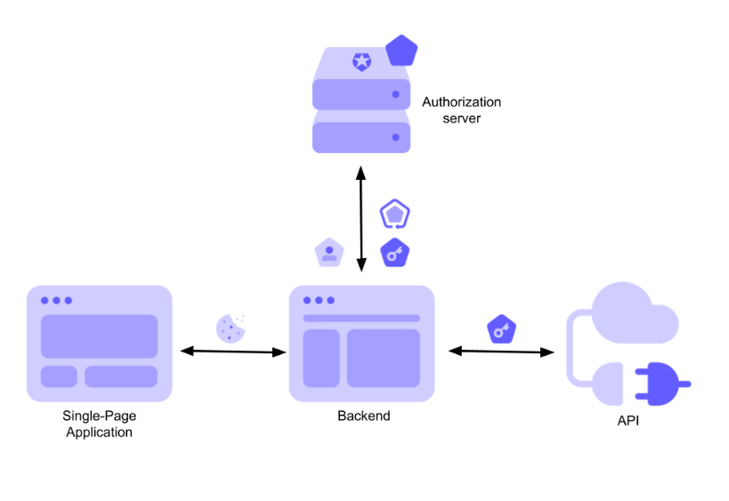

# Expo API Routes as BFF for auth example

This showcases how to use Expo API Routes as a BFF for handling OAuth2 auth code flow. You can read more about this pattern in [The Backend for Frontend Pattern (Auth0)](https://auth0.com/blog/the-backend-for-frontend-pattern-bff/).



The following is the flow for a web client:

1. Client sends user to the login page. The client should include the client_id and redirect_uri in the query string (e.g. `http://localhost:4000/login?client_id=client123&redirect_uri=http://localhost:8081/bff/continue`).
2. The auth server redirects the user to the AuthBFF's continue page with the code in the query string.
3. AuthBFF exchanges the auth code for an access token.
4. AuthBFF bakes the access token into a cookie and sends user to http://localhost:8081/
5. The client can now make requests with the access token in the cookie, and the AuthBFF will forward the request to the API server with the access token in the Authorization header.

and this is the flow for a native client:

1. Client sends user to the login page. The client should include the client_id and redirect_uri in the query string (e.g. `http://localhost:4000/login?client_id=client123&redirect_uri=expocookie://continue`).
2. The auth server redirects the user to the native apps continue (continue.tsx) page with the code in the query string.
3. The native app exchanges the auth code for an access token.
4. The native app stores the access token in SecureStore.
5. The native app can now make requests with the access token in the Authorization header.

## Get started

1. Install and start the API and auth servers

   ```bash
   cd servers
   yarn i
   yarn api
   yarn auth
   ```

2. Run the expo app

   ```bash
   yarn i
   yarn web
   ```

3. Open http://localhost:8081 in your browser, as you are navigated to the login page use the following credentials:

   - username: `foo`
   - password: `bar`

## TODO

- [x] SecureStore example for app
- [x] Long-lived refresh token example for app
